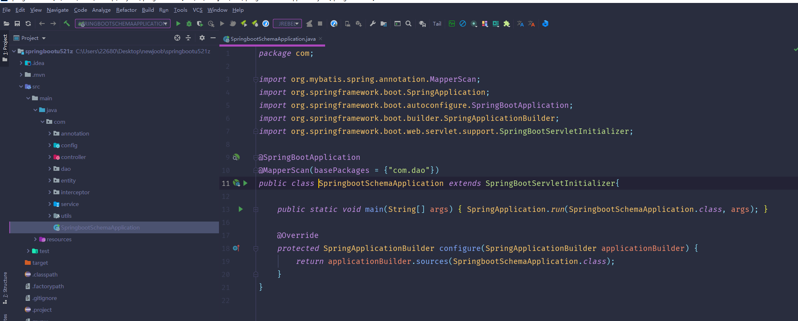
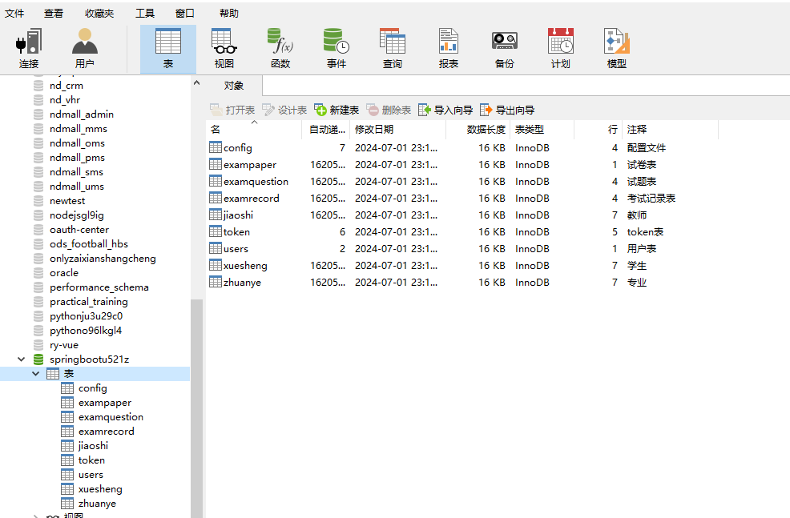
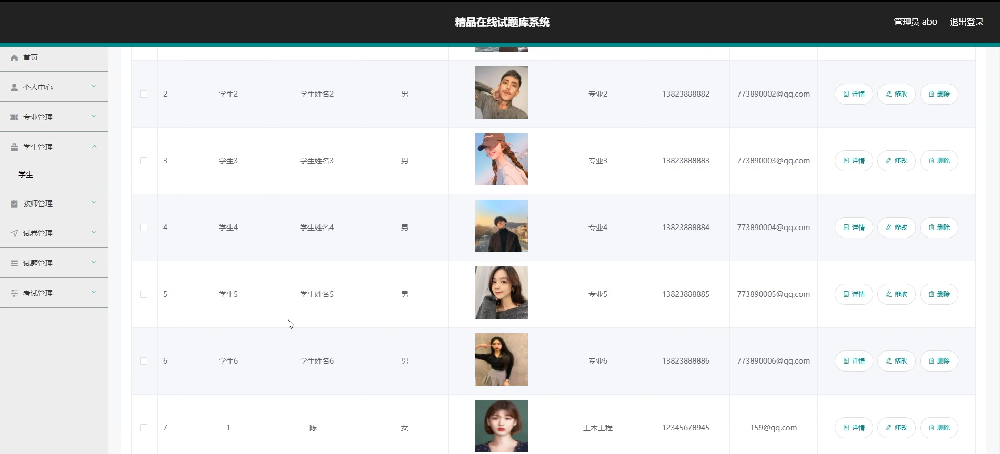
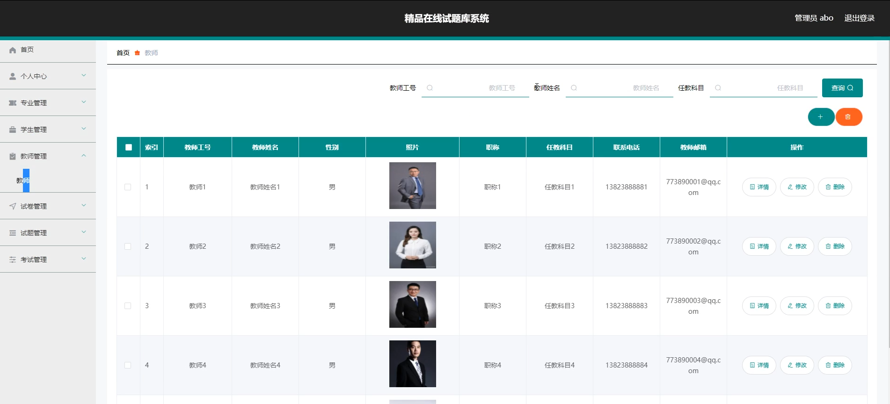
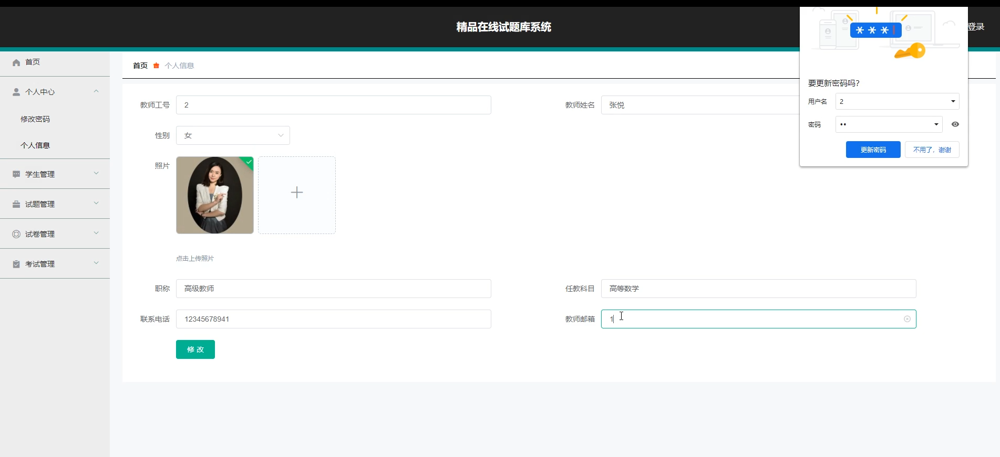
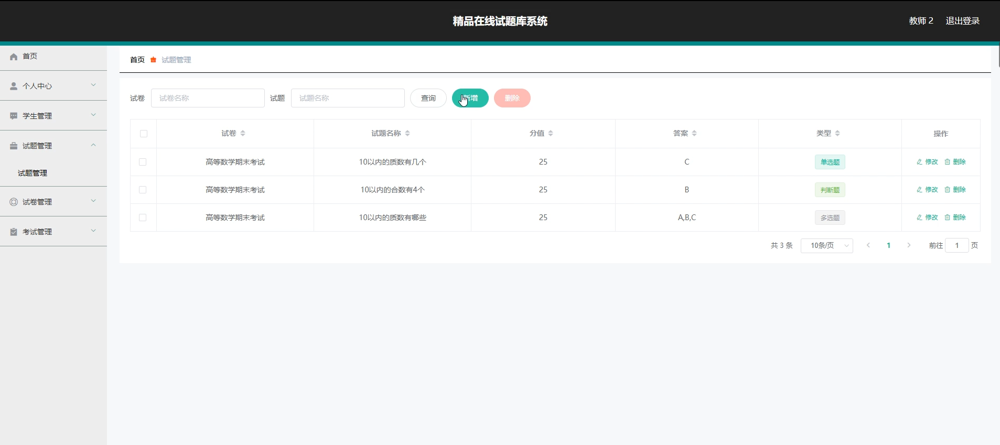
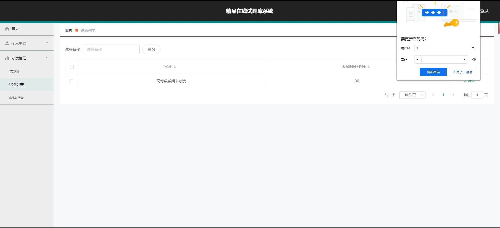
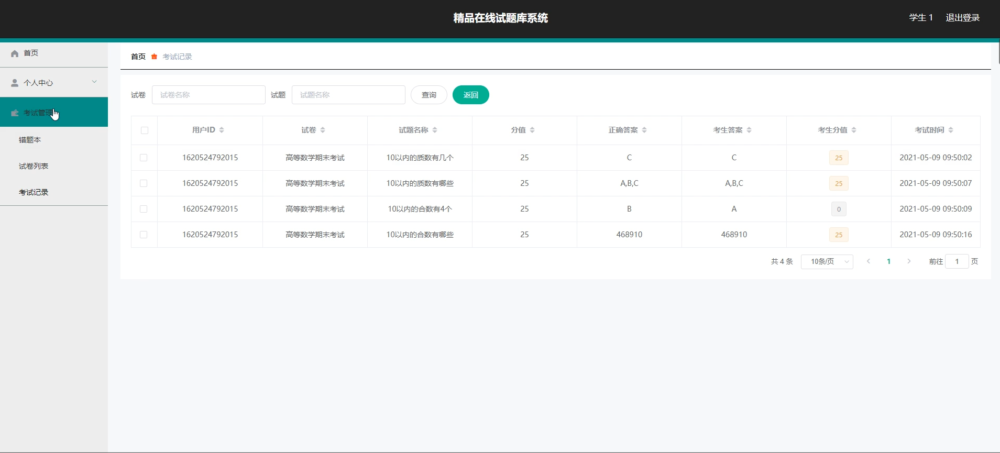
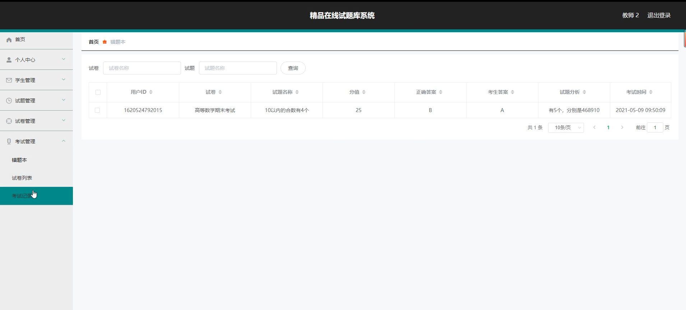

# 基于springboot的精品在线试题库系统

#### 介绍

在当今数字化教育的时代背景下，为了提升教学质量和学习效率，我们开发了这款基于 Spring Boot 的精品在线试题库系统。该系统旨在为学校、教育机构和学习者提供一个便捷、高效、全面的试题资源管理和学习平台，满足不同用户的需求，促进教育的智能化和个性化发展。
#### 技术栈

后端技术栈：Springboot+Mysql+Maven

前端技术栈：Vue+Html+Css+Javascript+ElementUI

开发工具：Idea+Vscode+Navicate

#### 系统功能介绍

（一）管理端
个人中心：管理端人员可以在此查看和修改个人信息，接收系统通知和重要消息。  
专业管理：对学校或教育机构所涉及的专业进行分类和管理，确保试题与专业的准确匹配。  
学生管理：负责学生的信息录入、修改、查询和统计，包括学生的基本信息、学习成绩等。  
教师管理：对教师的个人信息、授课科目、教学质量等进行管理和评估。 
试卷管理：进行试卷的创建、编辑、审核、发布和存档，可根据不同的考试要求和知识点分布生成多样化的试卷。  
试题管理：对试题进行分类、录入、修改、审核和删除，保证试题的质量和准确性，同时支持多种题型的管理。  
考试管理：统筹安排考试的时间、地点、参与人员等，监控考试过程，处理考试中的异常情况。  

（二）教师端    
个人中心：教师可以修改个人资料，查看工作通知和教学任务。  
学生管理：了解学生的学习情况，对学生进行分组管理，针对性地布置作业和辅导。  
试题管理：创建、编辑和审核试题，确保试题的科学性和适用性。  
试卷管理：根据教学需求和考试大纲生成试卷，对已有的试卷进行调整和优化。  
考试管理  
错题本：查看学生在考试中出现的错题，分析错误原因，为后续教学提供参考。  
试卷列表：查看自己创建或参与的试卷列表，了解试卷的使用情况和效果。  
考试记录：查看学生的考试成绩和答题情况，进行教学质量分析和总结。  

（三）学生端  
个人中心：学生能够修改个人信息，查看学习进度和考试安排。  
考试管理  
错题本：回顾自己在考试中做错的题目，进行针对性的复习和强化训练。  
试卷列表：查看已经完成和即将进行的试卷，了解考试的范围和要求。  
考试记录：查看自己的考试历史成绩和答题详情，分析学习中的薄弱环节。  

#### 系统作用

提升教学效率  
为教师提供了便捷的试题和试卷管理工具，大大减轻了教师出题和组卷的工作量，使教师能够将更多的精力投入到教学方法的改进和学生的个性化辅导上。  
教师可以通过错题本和考试记录快速了解学生的学习情况，及时调整教学策略，提高教学效果。  
个性化学习支持  
学生可以根据自己的错题本和考试记录，有针对性地进行复习和巩固，弥补知识漏洞，实现个性化学习。  
丰富的试卷资源和考试安排，能够满足不同学生的学习进度和能力水平，激发学生的学习兴趣和主动性。  
教学质量监控与评估  
管理端可以对教师的教学工作和学生的学习情况进行全面监控和评估，为教学管理提供数据支持，有助于及时发现问题并采取措施加以改进。  
系统生成的各类统计报表和分析数据，能够为教育决策提供科学依据，促进教学质量的不断提升。  
资源共享与优化利用  
集中管理的试题库实现了优质试题资源的共享，避免了重复劳动和资源浪费。  
不断更新和优化的试题库，能够适应教学大纲的变化和学科发展的需求，保持教学内容的时效性和先进性。  

#### 系统功能截图

代码结构

数据库表

登录

学生管理

教师管理

教师端个人信息

试题管理

学生端考试管理

考试界面

考试记录

错题本管理

#### 总结

本基于 Spring Boot 的精品在线试题库系统，通过合理的角色划分和功能设计，实现了试题库管理的规范化、智能化和个性化。它不仅为教师的教学工作提供了有力支持，也为学生的自主学习创造了良好条件，对于提高教学质量、促进教育公平具有重要意义。未来，我们将持续优化和完善该系统，以更好地满足教育教学的不断发展和创新需求。

#### 使用说明

创建数据库，执行数据库脚本 修改jdbc数据库连接参数 下载安装maven依赖jar 启动idea中的springboot项目

后台地址：http://localhost:8080/springbootu521z/admin/dist/index.html

管理员  abo 密码 abo

